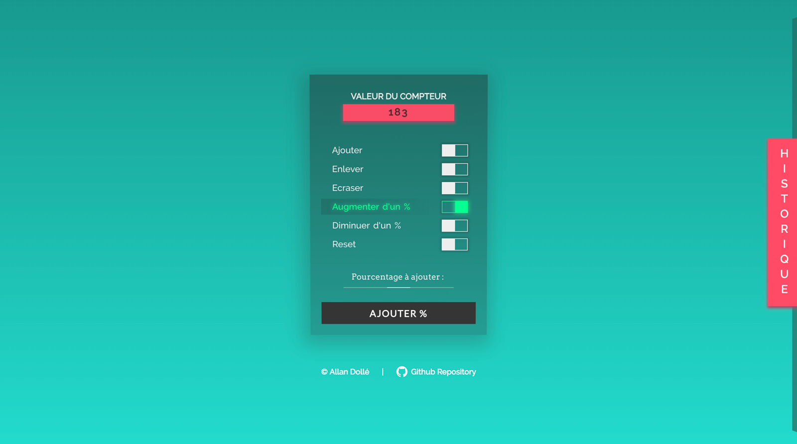

# simple-smiirl-counter
Simple and fast integration of the perso / custom [Smiirl](http://www.smiirl.com/fr/) counter.
This repo let you **show custom number** in your custom smiirl counter, and add **simple possibility to edit the number** with a basic user interface ([folder edit](edit/)).

**Edit actions are logged in** [edit.log](log/edit.log).

**Possible Edit actions are :**
- Add number from existing value
- Remove number from existing value
- Erase number with new value
- Reset number to zero

This repository is in operation at [dbcrenovation.fr](//dbcrenovation.fr/smiirl/)



## Requirements
- [Nginx](https://nginx.org/en/) or [Apache](https://httpd.apache.org/)
- PHP 7+

## Smiirl Documentation
Please, you maybe need to read the [official documentation of Smiirl](http://static.smiirl.com/wp-content/uploads/2017/05/guide-custom-sup.pdf).

## Configuration
### Basic
Edit the [config/client.php](config/client.php) file as you want
**You can just edit `$_PROJECT_FOLDER` and you are good to go**

``` php
$_PROJECT_FOLDER // absolute path of the folder which contain this project on your remote server
$_PATH_JSON_FILE // the path to .json file relative to $_PROJECT_FOLDER
$_PATH_LOG_FILE // the path to .log file relative to $_PROJECT_FOLDER
$_KEY_NAME // the name of the key relative to the number in your .json file
$_ACTIVE_EASTER_EGGS // Active easter eggs after submitting new number value
$_DEFAULT_INPUT_VALUE // The default input value of the form
$_HTML_COUNT // The output HTML in top of counter's number
$_ACTIONS // You can here change or create custom actions
```

### Customise actions
You can customise actions. See `$_ACTIONS` in [config/client.php](config/client.php).

### API
You can construct your home made solution. Documentation in progress ...

## Installation
- Just upload files in your apache or nginx server where you specify `$_PROJECT_FOLDER`.

> Exemple :
> Uploaded at 'http://your-domaine-name.com/Smiirl/'
> so `$_ROOT_URL = 'http://your-domaine-name.com'` (optional)
> and `$_PROJECT_FOLDER = '/Smiirl'`

Files/Folders to upload :
```
class/
config/
edit/
log/
template/
index.php
number.json (replace by the name in $_PATH_JSON_FILE if you change it)
.htaccess
```

- Go to your [Smiirl Account](https://my.smiirl.com/login) and specify your configuration.
> Exemple :
> If you follow the exemple bellow, specify http://your-domaine-name.com/Smiirl/ as URL
> in your Smiirl Account

- Protect the editing action with php or with .htpasswd (Ask Google)
- Enjoy !

## Editing the number value of your Smiirl Counter
Go to 'http://your-domaine-name.com/Smiirl/edit' if you follow the exemple bellow.
